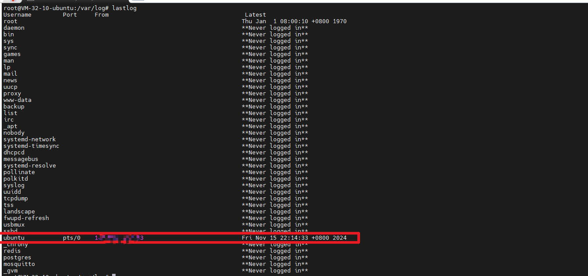
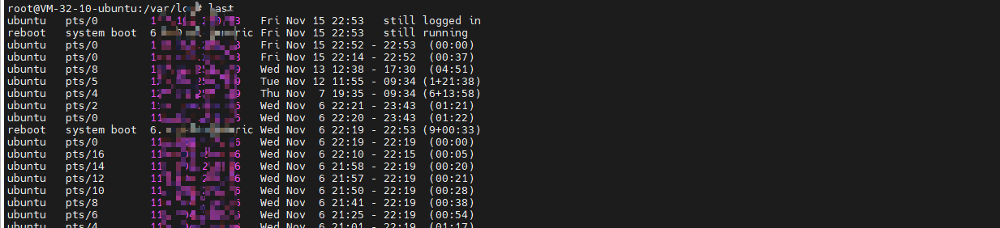
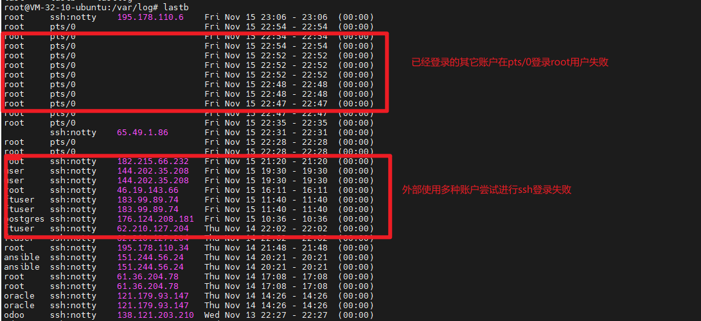
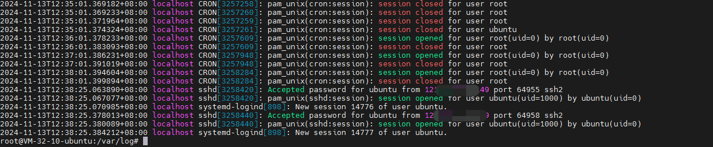
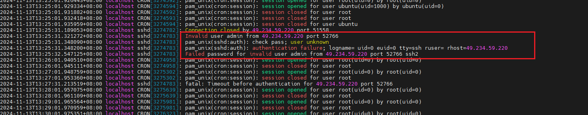
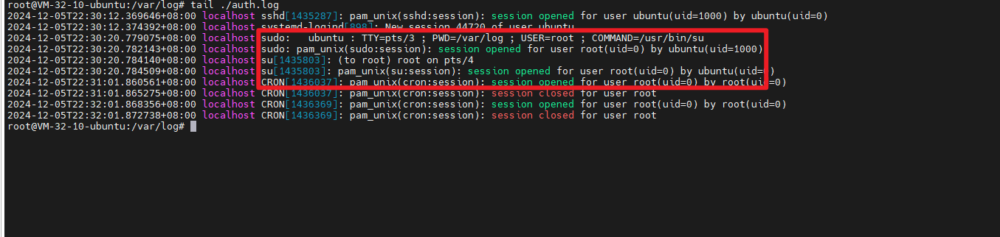
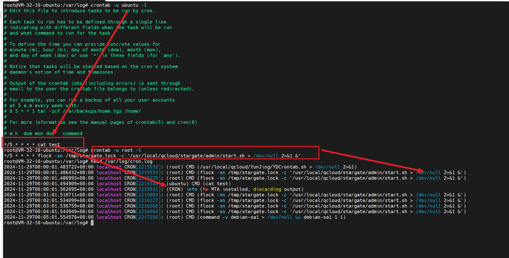
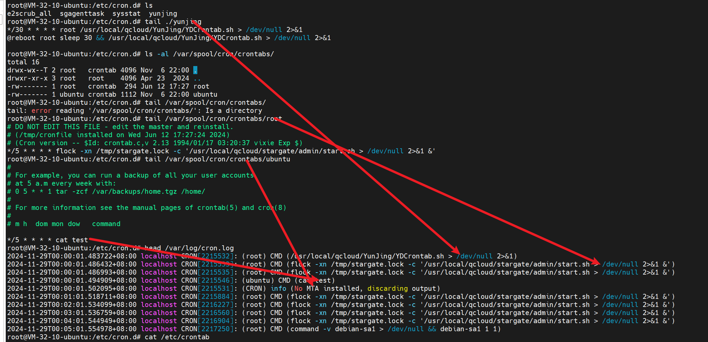
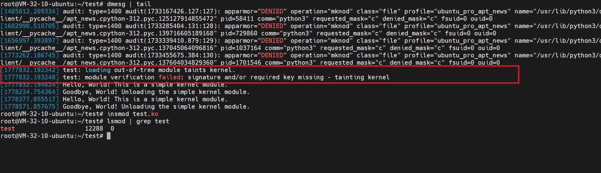

# Linux类系统日志取证分析

## 1、系统日志概述
        系统日志是记录Linux系统中与系统运行、用户登录和权限认证相关的信息，包括内核消息、系统服务的状态、用户登录和权限认证等信息。系统日志可以帮助我们
    分析系统安全事件、定位系统问题以及进行数据恢复等。

## 2、系统日志涉及的文件与路径
    Linux类系统日志涉及的文件与路径如下：
    1.  /var/log/messages
        该文件记录了系统启动后的信息和错误日志，是查看Linux系统信息最常用的文件之一。
    2. /var/log/syslog
        该文件记录了内核消息和系统服务的状态。
    3. /var/log/dmesg
        该文件记录了系统内核启动信息，包括硬件检测和驱动加载、文件系统检测等。
    4. /var/log/boot.log
        该文件记录了系统启动信息，包括内核版本、硬件检测和驱动加载等。
    5.  /var/log/secure or /var/log/auth.log
        该文件记录了用户登录和权限认证信息，包括密码错误日志、root用户的登录记录等。
    6.  /etc/rsyslog.conf 或 /etc/rsyslog.d目录下的日志配置文件
        该文件是系统日志配置文件，记录了各种日志的输出位置、日志类型以及日志级别等。
    7.  /var/log/lastlog
        该文件记录了所有账户最近一次登录的时间以及IP地址。与命令lastlog配合使用。
    8.  /var/log/wtmp 或 /var/log/utmp
        该文件记录了系统中所有账户的登录、注销及系统启动和关闭的信息。与命令last配合使用。
    9.  /var/log/btmp
        该文件记录系统中账户登录失败的日志文件，通过该日志我们可以分析出有哪些账户被尝试用于登录系统。与命令lastb配合使用。
    10.  /var/log/auth.log
        该文件记录了用户的登录信息，包括用户名、登录时间、登录IP地址等。与grep命令配合使用。
    11.  /var/log/cron.log
        该文件记录了定时任务相关的信息，包括创建、删除和执行情况等。

## 3、系统日志取证场景分析

### 3.1、攻击者获取到了用户账户密码直接登录
        攻击者利用了该账户密码直接登陆，是不会存在爆破的痕迹，所以该部分我们暂时不用考虑去分析爆破数据。我们需要分析wtmp日志(可以使用last命令)
        和auth.log日志，通过这两个日志我们可以分析出有哪些账户被尝试用于登录系统。

### 3.2、攻击者通过暴力破解获取到了用户账户密码登录
        攻击者利用了爆破破解的方式进行登陆，一般会出现多次登陆失败记录，少数登陆成功。分析爆破场景需要分析btmp日志(使用命令lastb)可以查看
    登陆失败的账户及IP地址等信息。

### 3.3、攻击者利用定时任务进行驻留
        一般僵尸网络等非常喜欢使用定时任务进行驻留。该部分我们先暂时不用考虑去分析定时任务数据，我们通过cron.log日志分析定时任务的创建、删除
    与执行轨迹。

### 3.4、攻击者利用了rootkit进行驻留
        攻击者利用了rootkit进行驻留，当其以内核模块作为rootkit驻留方式时，我们需要分析dmesg日志，通过该日志我们可以了解系统内核启动信息、硬件检测和驱动加载等。

## 4、附录-日志详述

### 4.1、/var/log/lastlog日志详述
        lastlog日志记录了所有账户最近一次登录的时间以及IP地址，通过该日志我们可以分析出近期账户的活跃信息，但是该日志是一个二进制文件并不能
    直接编辑，需要使用命令lastlog获取到其中的信息，下图为执行该命令获取到的账户最近一次登录信息。注：其中root命令的登录信息通过sudo su切换
    过去的root其最近一次登录信息并不会产生变化。

### 4.2、/var/log/wtmp or /var/log/utmp日志详述
        wtmp日志记录了系统中所有账户的登录、注销及系统启动和关闭的信息，该日志中记录了登录的用户名、pts号、登录IP、登录时间及该账户的活动
    时间长度，该日志同样是一个二进制文件并不能直接编辑，可以通过命令last查看，使用last命令查看的信息如下图。

### 4.3、/var/log/btmp日志详述
        btmp日志记录系统中账户登录失败的日志文件，通过该日志我们可以分析出有哪些账户被尝试用于登录系统，在爆破破解场景中该日志具有一定的
    分析作用，该日志同样是一个二进制文件并不能直接编辑，需要使用命令lastb查看该日志信息，该命令返回的信息中存在尝试登录的账户名、pts、
    尝试登录时间等，执行命令的信息如下。

### 4.4、/var/log/auth.log or /var/log/secure日志详述
        auth.log中记录了用户的登录信息，包括用户名、登录时间、登录IP地址等。通过分析auth.log，可以了解用户登录情况、异常登录行为等（
    centos类系统其记录登录信息的为secure日志，auth.log主要在debian类系统如ubuntu等）。其中每次登陆成功会打开2个session并且记录下对应
    的用户名、登录时间、登录IP地址、登陆端口等，关闭时同样会关闭该两个session。在人工分析下可使用命令grep "Accepted" /var/log/auth.log 
    查看对应的日志中存在哪些账户成功登陆（部分已经已经被备份了需要重新取出来分析）。

        在该日志中，对于登陆失败的记录，同样会记录对应的用户名、登陆时间、登陆IP地址、登陆端口等。失败登陆在我们的取证分析中还是较为
    重要的，攻击者可能会对主机进行爆破登陆，可以使用爆破IP进行扩线（扩展线索），找到其中疑似攻击者的IP（对于一些僵尸网络的爆破IP可酌情排除）。
    同样的，在人工分析下可使用命令grep "Failed" /var/log/auth.log 查看对应的日志中存在哪些账户失败登陆。

        对于sudo su切换过去的用户，在auth.log文件中同样会记录是从哪个用户root用户。

### 4.5、/var/log/cron.log日志详述
        cron.log日志记录了定时任务相关的信息，通过该日志我们可以分析出有哪些定时任务被创建、删除以及执行情况。在debian类系统如ubuntu等，
    该日志文件为/var/log/cron.log，并且该日志在这类系统里默认不会开启。

        在下图的示例日志中，我们可以看到ubuntu用户、root用户的定时任务被执行的记录，并且记录了定时任务执行的时间、执行的命令、文件等，
    该类信息可以从日志中抽取出来进行后续的关联分析。

        上述的日志记录的定时任务主要为"/etc/crontab"、"/var/spool/cron/"以及"/etc/cron.d/"目录下的文件。对于"/etc/cron.xxily/"
    目录下的文件，其执行创建等并不会进行记录。

    ref:https://little-star.love/posts/805d7d3d/

### 4.5、/var/log/dmesg日志详述
        dmesg日志记录了系统内核启动信息，包括硬件检测和驱动加载、文件系统检测等。该日志同样是一个二进制文件并不能直接编辑，需要使用命令
    dmesg查看该日志信息。
        当攻击者使用insmod等命令直接加载ko内核模块时，在第一次加载时dmesg中会记录该模块的加载信息，但是加载的信息不是很多，加载图如下。
    当系统没有重启后再次加载该模块时，dmesg中不会记录该模块的加载信息。

## 5、引用
    1、https://www.isisy.com/1477.html
    2、https://little-star.love/posts/805d7d3d/